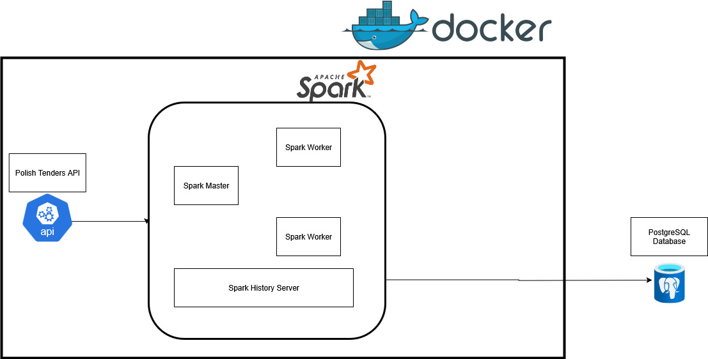

# Apache-Spark-Polish-Procurement

## Introduction
The purpose of this project is to build an end to end data pipeline.  It covers each stage from data ingestion to processing and finally to storage, utilizing a robust tech stack that includes Python, Apache Spark, and PostgreSQL. Everything is containerized using Docker for ease of deployment and scalability.

## System Architecture

The project is designed with the following components:
- Data Source: We will use https://tenders.guru/pl/api#get-tender-details a Polish procurement API to get procurement data in JSON format.
- Apache Spark: For data processing with its master and worker nodes.
- PostgreSQL: Where the processed data will be stored.
- Docker: To run code on an isolated container with all the necessary dependancies.

### Here is one of the entries in the JSON:
{'id': '586948',
   'date': '2023-05-03',
   'title': 'Dostawa licencji IBM wraz z 12 miesięcznym wsparciem technicznym producenta',
   'category': 'supplies',
   'description': '1. Przedmiotem zamówienia jest dostawa licencji wraz z zapewnieniem 12 miesięcznego wsparcia technicznego Producenta dla:\n1.1. IBM Db2 Standard Edition Cartridge for IBM Cloud Pak for Data Virtual Processor Core License + SW Subscription &amp; Support 12 Months “lub równoważnym” – 60 sztuk;\n1.2. IBM Db2 Advanced Edition AU Option for Non-Production Environments Authorized User License + SW Subscription &amp; Support 12 Months “lub równoważnym” – 8 sztuk;\n1.3. IBM WebSphere Hybrid Edition Virtual',
   'sid': 'award:171361',
   'awarded_value': '2817192.00',
   'awarded_currency': 'PLN',
   'awarded_value_eur': '611701.66',
   'purchaser': {'id': '27317', 'sid': None, 'name': None},
   'type': {'id': 'procedura-otwarta',
    'name': 'Procedura otwarta',
    'slug': 'procedura-otwarta'},
   'awarded': [{'date': '2023-04-24',
     'value_for_two': 2817192,
     'value_for_two_eur': 611701.66,
     'suppliers': [{'name': 'Techsource Sp. z o.o. (Lider Konsorcjum)',
       'id': 28414,
       'slug': 'techsource-sp-z-o-o-lider-konsorcjum'},
      {'name': 'Decsoft S.A. (Konsorcjant)',
       'id': 28415,
       'slug': 'decsoft-s-a-konsorcjant'}],
     'value_min': '0.00',
     'value_for_three': 2817192,
     'value_for_one_eur': 0,
     'count': '1',
     'value_for_one': 0,
     'value_for_three_eur': 611701.66,
     'suppliers_id': '28414,28415',
     'value_eur': 611701.66,
     'value_max': '0.00',
     'offers_count': [2],
     'suppliers_name': 'Techsource Sp. z o.o. (Lider Konsorcjum) Decsoft S.A. (Konsorcjant)',
     'value': '2817192.00',
     'value_estimated': '3080739.34',
     'offers_count_data': {'2': {'value_eur': 611701.66,
       'count': '1',
       'value': '2817192.00'}}}]}
